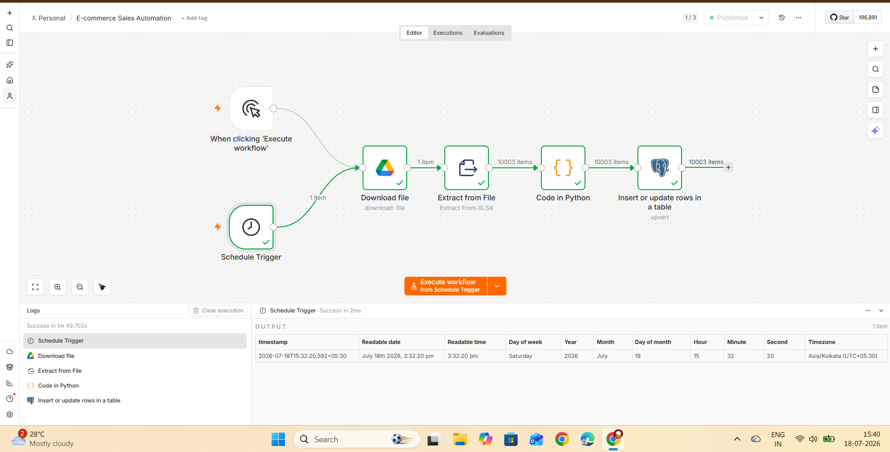
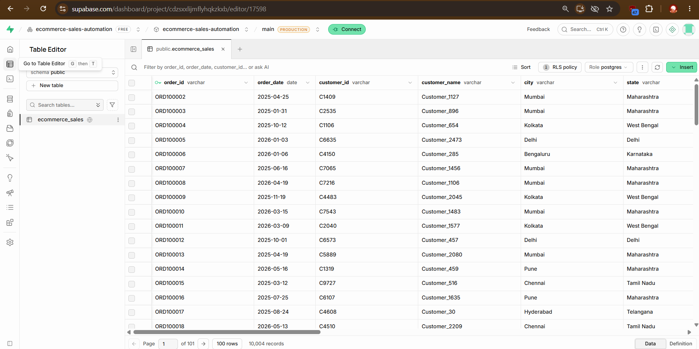
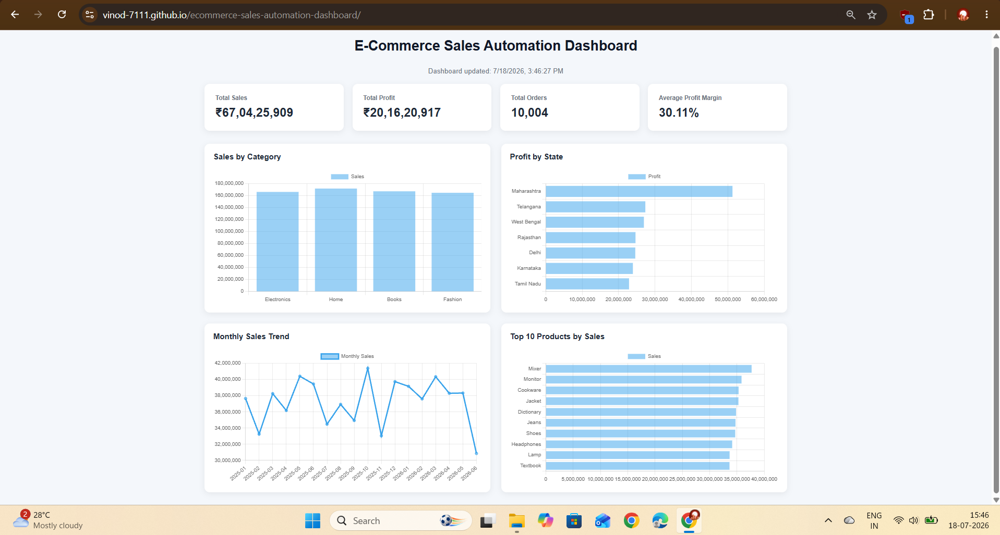
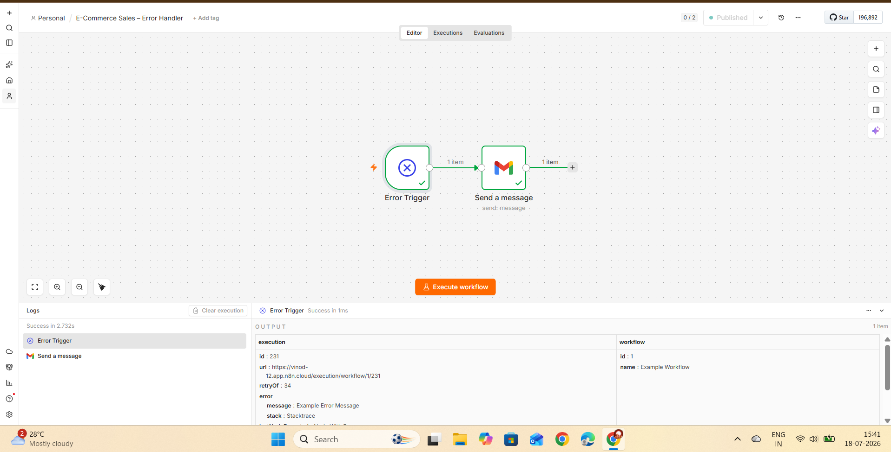

# E-Commerce Sales Automation Dashboard

An end-to-end automated E-Commerce Sales Analytics project that processes sales data using n8n and Python, stores the processed data in Supabase, and displays interactive business insights through a web dashboard hosted on GitHub Pages.

## Project Overview

This project demonstrates an automated data pipeline for e-commerce sales analytics.

The workflow automatically retrieves an Excel dataset, extracts and processes the data, loads it into a PostgreSQL database using Supabase, and makes the latest data available to an interactive sales dashboard.

## Project Architecture

```text
Excel / Google Drive
        ↓
n8n Schedule Trigger
        ↓
Download File
        ↓
Extract XLSX Data
        ↓
Python Data Processing
        ↓
Supabase PostgreSQL
        ↓
GitHub Pages Dashboard

If Workflow Fails:
        ↓
n8n Error Trigger
        ↓
Gmail Error Notification
```

## Technologies Used

- n8n - Workflow automation
- Python - Data processing and transformation
- Supabase - PostgreSQL database
- Google Drive - Source file storage
- HTML, CSS and JavaScript - Dashboard development
- Chart.js - Data visualization
- GitHub - Version control
- GitHub Pages - Dashboard hosting
- Gmail - Automated error notifications

## Dashboard Features

The dashboard provides:

- Total Sales
- Total Profit
- Total Orders
- Average Profit Margin
- Sales by Category
- Profit by State
- Monthly Sales Trend
- Top 10 Products by Sales

## Automation Workflow

The n8n workflow automatically:

1. Runs using a Schedule Trigger.
2. Downloads the latest Excel file from Google Drive.
3. Extracts the Excel data.
4. Processes and cleans the data using Python.
5. Inserts or updates records in Supabase.
6. Makes the updated data available to the dashboard.
7. Sends an email notification if the automation workflow fails.

## Error Handling

A separate n8n Error Handler workflow monitors automation failures.

If the main workflow fails, the Error Trigger activates and sends an email notification containing information about the failed workflow and error.

## Project Screenshots

### n8n Automation Workflow



### Supabase Database



### E-Commerce Sales Dashboard



### n8n Error Handler



## Project Result

The project creates an automated pipeline where new or updated sales data can flow from the source dataset to the database and analytics dashboard with minimal manual intervention.

The dashboard dynamically retrieves data from Supabase, allowing KPIs and charts to reflect updated sales information.

## Future Improvements

- Add dashboard filters for date, state and category.
- Add year-over-year sales analysis.
- Add customer segmentation.
- Add sales forecasting using machine learning.
- Add automated business reports.
- Improve dashboard responsiveness for mobile devices.

## Author

Vinod
